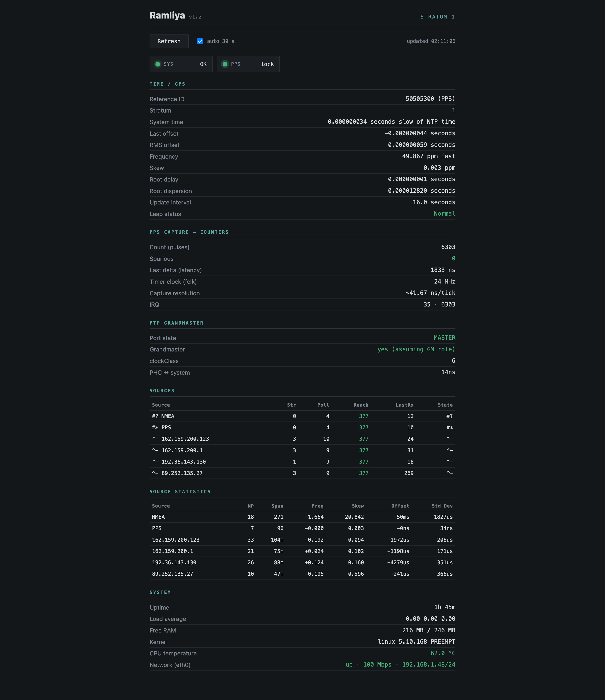

# Ramliya

**Precision Stratum-1 NTP Time Server & PTP Grandmaster on AM335x with DMTimer Hardware PPS Capture**

> "We were somewhere around Barstow on the edge of the desert when the drugs began to take hold..."
> — Hunter S. Thompson, *Fear and Loathing in Las Vegas*

This project turns a decommissioned Antminer L3+ control board — a $10 industrial-grade BeagleBone Black clone — into a sub-100 ns precision time server, by exploiting hardware edge-capture registers buried deep in the TI AM335x documentation.

---

## Results

Measured on the final build under sustained CPU and I/O load. The "Baseline" column is the same hardware running standard `pps-gpio` software interrupt timestamping.

| Metric | Baseline (`pps-gpio`) | Final (`pps-dmtimer`) |
| :--- | :--- | :--- |
| PPS Jitter (Std Dev) | 91–92 ns | **20 ns** |
| PPS Offset | ±10 ns | **+6 ns** |
| RMS Clock Offset to GPS | 100–360 ns | **69 ns** |
| Frequency Skew | 0.012 ppm | **0.003 ppm** |
| System Time vs GPS | ~100 ns | **< 1 ns** (below chrony display resolution) |
| PHC ↔ System Offset | 8–24 ns | **−3 ns** |
| IRQ Latency (p50 / p99) | 3958 / 4291 ns | 3875 / 5125 ns |
| Spurious / Missed Pulses | 0 | **0** (verified over 1,686 consecutive pulses) |

The 20 ns jitter sits at the theoretical floor of our 24 MHz capture clock (one tick = 41.7 ns ≈ 12 ns RMS quantization noise). Further improvement requires a faster timer clock or a timing-grade GNSS receiver.

### System Resources

The entire stack — kernel, nine services (gpsd, chrony, ptp4l, phc2sys, dropbear, httpd, syslogd, udhcpc, getty), Finit init, and a UBIFS overlay — uses **12 MB of RAM** out of 256 MB available. The kernel image is 3.5 MB (`zImage`, monolithic, zero modules), the initramfs is 6.1 MB (cpio+gzip). The system fits in 256 MB of SLC NAND (10 MTD partitions: SPL, U-Boot, kernel, initramfs, and a 228 MB UBI volume with over 200 MB free). Boot from SD card to link-up on Ethernet takes under **8 seconds**.

---

## How It Works

### The Problem

Standard PPS-to-NTP setups use `pps-gpio`: a rising edge triggers a GPIO interrupt, the CPU context-switches into the ISR, and `ktime_get_real_ts64()` captures a timestamp. Under load, the latency between the physical edge and the timestamp call drifts unpredictably — 15 to 40 µs of jitter that directly corrupts clock discipline.

### The Solution

The TI AM335x SoC has hardware capture registers in its DMTimer peripherals. When a rising edge hits the timer input pin, the hardware *instantly* latches the free-running counter value (`TCRR`) into the capture register `TCAR1` — no software involvement whatsoever. The ISR still fires to process the event, but now it can compute the *exact* edge arrival time retroactively:

$$T_{edge} = T_{ISR} - \frac{TCRR_{ISR} - TCAR1}{f_{clk}}$$

The entire IRQ-to-handler latency (measured: p50 ≈ 4 µs, p99 ≈ 5 µs under load) is subtracted from the timestamp. What remains is a single tick of the 24 MHz clock — 41.7 ns. The driver also handles posted-mode register access delays and provides live sysfs diagnostics (`last_delta_ns`, `count`, `spurious`).

Proof that this works: doubling the IRQ latency under stress (3.9 µs → 6.2 µs p50) produced **zero** change in PPS jitter (92 ns → 91 ns). The hardware capture makes the software path irrelevant to precision.

---

## Hardware

### Board

| Component | Details |
| :--- | :--- |
| SoC | TI AM3352BZCZ100 Sitara — single-core Cortex-A8 @ 1 GHz, ARMv7 rev2, ES2.1 |
| RAM | Nanya NT5CC128M16 DDR3L, 256 MiB |
| NAND | Micron MT29F2G08ABAEAWP, 256 MiB (2 Gbit), x8, SLC, page 2048, OOB 64, BCH8 HW ECC via ELM |
| Ethernet PHY | SMSC LAN8710/LAN8720 (`smsc_phy` driver) |
| PMIC | TPS65217C on I²C @ 0x24 (ID 0x0e, version 1.2) |
| Board | Bitmain "ANTMINER BB_Black" (v1.8 green mask / v2.3 dark mask) |
| **Not populated** | eMMC, PRU-ICSS, GFX/SGX, TDA19988 HDMI framer, TPS2051 USB switch, HDMI and USB-A connectors |

### GNSS & PPS

- **Receiver:** u-blox NEO-6M (iTead module), NMEA over UART, 1PPS output
- **PPS routing:** NEO-6M PPS → P9_41 (pin `xdma_event_intr1`, offset `0x1B4`, MODE4 = `timer7` input) → DMTimer7 TCAR1 hardware capture
- **NMEA routing:** NEO-6M TX → P9_22 (offset `0x150`, MODE1 = `uart2_rxd`) → `/dev/ttyS2` (controller `0x48024000`)

### Signal Chain

```
NEO-6M ── NMEA/ttyS2 ──→ gpsd ──→ SHM(0) ──→ chrony (noselect, sanity check)
   └──── PPS/P9_41 ──→ timer7 TCAR1 ──→ pps-dmtimer ──→ /dev/pps0 ──→ gpsd ──→ SHM(2)
                                                                            ↓
                                              chrony ← PPS refclock (prefer)
                                                 ↓                        ↓
                                  phc2sys: system → PHC(/dev/ptp0)   NTP stratum-1
                                                 ↓
                                  ptp4l: PTP Grandmaster, HW timestamping
```

---

## The Journey

This section exists because the metrology table above is the end of a story, not the beginning. The project started with an Antminer L3+ control board running the original Bitmain firmware from NAND (the stock SD card update images contain only the device tree and initramfs, not a full OS), and every step forward required solving a problem that had no existing documentation.

### Reverse-Engineering the Board

The L3+ control board is a BeagleBone Black derivative manufactured by Bitmain, marked as "ANTMINER BB_Black" (two known revisions: v1.8 with a green solder mask and v2.3 with a dark mask — differing in layout details). Despite sharing the AM335x SoC, the board differs from the original BBB in ways that make the stock BeagleBone Black device tree unusable: it has SLC NAND flash instead of eMMC, the AM3352 SoC variant physically lacks the PRU-ICSS and GFX/SGX subsystems, the TDA19988 HDMI framer is absent, the USB host switch (TPS2051) is not populated, and the HDMI and USB Type-A connectors along with their supporting circuitry are missing from the board entirely. These are not optional features that can be left enabled harmlessly — each unpopulated peripheral with an active DT node causes probe failures or outright kernel panics on boot.

The starting point was extracting `config.gz` and the device tree blob from the stock 3.8 kernel shipped in NAND, decompiling the DTB, and cross-referencing every node against the BeagleBone Black schematic and the AM335x TRM to map exactly what is and isn't present on this board.

### Porting to Linux 5.10

The stock 3.8 kernel can be rebuilt and reconfigured — it boots — but there is no reason to stay on it. Porting to 5.10 LTS meant reworking the device tree substantially, using the decompiled vendor DTB (which carried the correct NAND/GPMC parameters) and the original BeagleBone Black DT as reference points. The 3.8-era DT used legacy bindings (`ti,elm-id = <0x10>` instead of proper phandle `<&elm>`, no `target-module` wrappers, flat GPMC nodes) that do not compile against 5.10's `am33xx.dtsi` base. The port required 11 kernel patches to bridge hardware-specific gaps: NAND ECC probe ordering, RTC clock source selection, bandgap thermal sensor, DMTimer reservation conflicts, CPTS clock name mismatch, and others.

Early boot was a cascade of panics. The base `am33xx.dtsi` enables peripherals that don't exist on the L3+ — the GFX/SGX block, PRU-ICSS, and TSC/ADC all trigger `omap_reset_deassert` timeouts when their reset domains are accessed on an AM3352 with those blocks unpopulated. Each one had to be found by its register address in `dmesg` and disabled in the DT at the `target-module` wrapper level (disabling only the inner node is not sufficient).

### The NAND Problem

The Micron MT29F2G08 NAND uses BCH8 ECC with the AM335x hardware ELM (Error Location Module). Getting this right on 5.10 required explicit DT properties (`ti,nand-ecc-opt = "bch8"`, `ti,elm-id = <&elm>`) and careful GPMC timing parameters extracted from the stock DTB. A later experimental port to kernel 6.12 exposed a deeper issue: the new `nand_base` enables sequential cached reads (`cont-read`, command `0x31`) when the chip advertises `supports_read_cache`, which is incompatible with the AM335x GPMC prefetch engine — causing silent, position-dependent read failures during UBI mount. That bug cost significant debugging time and was ultimately fixed by disabling `cont-read` at `attach_chip` time.

The NAND partition layout was also reworked from the Bitmain original. The stock layout had a 512 KB dead gap between the kernel and rootfs partitions (kernel ended at `0x780000`, rootfs started at `0x800000` — unexplained Bitmain padding), and the final `config` partition used only 20 MB out of the remaining 230+ MB of flash. The current layout absorbs the gap into the kernel partition (5.0 → 5.5 MB), renames `root` to `initramfs` to reflect its actual role, and expands the final partition to a 228 MB UBI volume spanning all remaining NAND.

### The UART Debugging

Wiring a GPS module to a UART should be straightforward. It was not. TI uses two incompatible numbering schemes simultaneously: the TRM chapter numbering (1-based: uart1, uart2, uart3) and the pin configuration register naming (0-based: `conf_uart0_rxd`, `conf_uart1_rxd`, `conf_uart2_rxd`). The register named `uart2_rxd` at pinctrl offset `0x150` routes to the controller at `0x48024000` — which the hwmods subsystem calls `uart3`, and Linux exposes as `/dev/ttyS2`. For a significant amount of debugging time, the DT was configured for controller `0x48022000` (`ttyS1`), with the correct pins muxed but routed to the wrong peripheral. The GPS signal physically arrived at the SoC but was consumed by a controller that nothing was listening on.

The diagnostic that finally resolved it was the internal UART loopback test: writing `MCR bit4 = 0x10` via `devmem` to the suspected controller and checking whether echoed data appeared. The controller at `0x48022000` looped back fine — proving the UART hardware worked but the pin routing was wrong.

### The PPS Driver

With NMEA flowing, the remaining challenge was precision. The standard `pps-gpio` driver gave usable but mediocre results (~90 ns jitter, sensitive to load). The custom `pps-dmtimer` driver was modeled after the `pwm-omap-dmtimer.c` platform data pattern — in kernel 5.10, the `omap_dm_timer_*` API symbols are static and unexported, so the timer must be acquired through `dev_get_platdata()->timer_ops->request_by_node()`, using a DT phandle to deterministically select a specific timer (DMTimer7).

An early version of the driver used MODE5 for the capture pin (`0x1B4`), based on incorrect notes. MODE5 on this pin maps to `pr1_pru0_pru_r31_16` — a PRU signal that doesn't exist on the AM3352. The timer saw no edges, produced no interrupts, and gave no error. Switching to MODE4 (`0x24` = timer7 input + RXACTIVE) fixed it silently. This is the kind of failure that can only be found by reading the datasheet pin-by-pin.

### What Didn't Work

- `ppstest` on 32-bit ARM with `time64` produces corrupted output (sequence numbers ~10⁹, zero nanoseconds) due to a `pps_fdata` struct layout mismatch. Verification had to be done through `ntpshmmon` and chrony `sourcestats`.
- `request_by_cap()` for timer acquisition is non-deterministic — it returns any PWM-capable timer, not necessarily the one whose pin is wired.

---

## Prerequisites

This is a bare-metal hardware bring-up — there are no pre-built images or automated installers. You will be cross-compiling a patched Linux 5.10 kernel, writing Device Tree sources against `am33xx.dtsi`, and reading the AM335x Technical Reference Manual to verify pin multiplexing at the register level. A working Buildroot environment and a UART-TTL serial adapter for early boot console access are assumed throughout the documentation.

---

## Software Stack

| Component | Details |
| :--- | :--- |
| Kernel | Linux 5.10.168 LTS, monolithic (0 modules), `PREEMPT`, `HZ=1000`, **built separately** (not through Buildroot) |
| Kernel toolchain | `arm-none-linux-gnueabihf-gcc 10.3` (Linaro 2021.07) |
| Build system | Buildroot 2025.02.x (custom defconfig, external tree) — **builds initramfs only**, not the kernel |
| Buildroot toolchain | Internal GCC 13.4.0, musl 1.2.6, hardfloat |
| Init | Finit 4.17 (service supervision, built-in watchdog, RTC/TTY/urandom plugins) |
| Root filesystem | UBIFS on NAND with persistent overlay; initramfs (cpio+gzip) for boot |
| BusyBox | 1.38.0 (httpd, udhcpc, syslogd, and core utilities) |
| GNSS daemon | gpsd 3.25 (`-n -s 9600`, `max_devices=2`) |
| NTP | chrony 4.8 (SHM 0 noselect + SHM 2 PPS prefer) |
| PTP | linuxptp 4.4: ptp4l (Grandmaster, HW timestamping) + phc2sys |
| PPS driver | `pps-dmtimer-am335x.c` v1.2 (in-tree, patch 0009) |
| Web interface | BusyBox httpd on port 8080, read-only status page (HTTP, no TLS) |



---

## Project Structure

```
├── reference/                     # Stock Bitmain firmware forensics
│   ├── config/                    #   Extracted kernel configs (3.8 stock, antBBB defconfig)
│   ├── dt/                        #   Decompiled vendor DTBs (baseline reference)
│   ├── nand-dump/                 #   Original Bitmain boot files (MLO, u-boot, DTB, uImage)
│   └── README.md
│
├── buildroot/
│   ├── configs/                   # l3plus_ntp_defconfig
│   ├── board/l3plus/              # Post-build scripts, BusyBox fragment
│   ├── patches/                   # Buildroot package patches (version upgrades, checksum fixes)
│   └── rootfs-overlay-ntp/        # Production overlay (Finit units, chrony/gpsd/ptp4l configs)
│
├── docs/
│   └── img/                       # Screenshots and diagrams for README
│
├── driver/
│   ├── pps-dmtimer-am335x.c       # Standalone copy of the DMTimer PPS capture driver
│   └── README.md                  # In-tree integration instructions
│
├── dts/
│   ├── am335x-l3plus.dts          # Monolithic board device tree (no overlays)
│   └── Makefile                   # DTB build via cpp + dtc against kernel source
│
├── kernel/
│   ├── configs/                   # Kernel defconfig (NTP profile)
│   ├── uEnv.txt                   # U-Boot environment for SD card boot
│   └── patches/                   # 11 kernel patches (0001–0011)
│       ├── 0001  NAND/ELM EPROBE_DEFER ordering
│       ├── 0002  RTC: force internal 32 kHz oscillator
│       ├── 0003  hwmon: AM335x bandgap thermal sensor
│       ├── 0004  NAND: disable cont-read (GPMC incompatibility)
│       ├── 0005  PM: skip voltage late-init on AM33xx
│       ├── 0006  clk: debugss no-IDLEST
│       ├── 0007  bus/ti-sysc: treat EBUSY timer as reserved
│       ├── 0008  CPTS: fix clock name typo
│       ├── 0009  pps-dmtimer-am335x: hardware capture PPS driver
│       ├── 0010  pps-gpio: propagate error codes (EPROBE_DEFER)
│       └── 0011  ASoC/McASP: limit SDMA/UDMA PCM selects
│
├── LICENSE                        # GPL-2.0
└── README.md
```

---

## Kernel Patches

All 11 patches live in `kernel/patches/` and are applied in numeric order during the Buildroot build. Each addresses a specific gap between the AM335x mainline support in 5.10 and the reality of this board:

| # | Patch | Why |
| :--- | :--- | :--- |
| 0001 | `nand-omap2-elm-eprobe-defer` | ELM probes after NAND — defer instead of fail |
| 0002 | `rtc-omap-force-internal-32k` | No external 32 kHz crystal on L3+ — force internal oscillator (without this, RTC freezes and `poweroff` panics) |
| 0003 | `hwmon-am335x-bandgap` | Out-of-tree bandgap thermal sensor driver |
| 0004 | `nand-omap2-disable-cont-read` | Disable sequential cached reads — incompatible with GPMC prefetch (discovered during 6.12 port, backported as defense) |
| 0005 | `omap2-pm-skip-voltage-late-init` | AM33xx voltage init causes probe failures |
| 0006 | `clk-ti-am33xx-debugss-no-idlest` | debugss clock lacks IDLEST register — skip polling |
| 0007 | `bus-ti-sysc-treat-ebusy-timer-as-reserved` | DMTimers claimed by clocksource return EBUSY — treat as reserved, not error |
| 0008 | `cpts-fix-clock-name-typo` | Clock name string mismatch in CPTS driver |
| 0009 | `pps-dmtimer-am335x` | **The core driver** — hardware PPS capture via TCAR1 |
| 0010 | `pps-gpio-propagate-error-codes` | `pps-gpio` swallows EPROBE_DEFER — propagate properly |
| 0011 | `asoc-ti-mcasp-limit-sdma-udma-pcm` | McASP: SDMA_PCM only on DRA7, UDMA_PCM only on K3 — prevents build failures on AM335x |

---

## Status

The NTP/PTP timing chain is fully operational and auto-starts from cold boot. Current work areas:

- [ ] **GNSS receiver comparison:** evaluating the current NEO-6M against a Mode-S Beast & GPS Decoder Board with a timing-grade Trimble RES SMT 360 (97975-05)
- [ ] **Kernel 6.12 TI RT comparison:** an experimental port to the TI RT kernel was paused at NAND bring-up (see Kernel Patches §0004); comparison of timing performance against the working 5.10 build is planned
- [ ] **Professional antenna:** external HOPF 4490 with a dedicated 5V bias-tee module
- [ ] **TCXO upgrade:** replacing the board's stock crystal oscillator with an external TCXO
- [ ] **Thermal management:** copper heat spreader for the SoC, passive enclosure design
- [ ] HZ / NO_HZ kernel tuning based on jitter profile analysis
- [ ] Front-panel LED indication (SYS + PPS dual-color status, designed — awaiting enclosure)
- [ ] **Management TUI:** dialog-based text UI on serial console (ttyS0), inspired by Dell EqualLogic administration interface

---

## Acknowledgments

### Core Inspiration

**Dan Drown** — his series of articles on NTP with AM335x hardware timestamping ([blog.dan.drown.org/tag/ntp/](https://blog.dan.drown.org/tag/ntp/)) and the original [`pps-gmtimer`](https://github.com/ddrown/pps-gmtimer) driver demonstrated that DMTimer hardware capture was a viable path to sub-microsecond PPS precision. The architecture of `pps-dmtimer-am335x` grew directly from that idea.

### Direct Contributors to This Project

**Oleg Gavavka** ([@Ga-Ol-St](https://github.com/Ga-Ol-St)) — special thanks. His [detailed commentary](https://gist.github.com/X3msnake/ed5337bb6b21dc5c40036b204968dfd4?permalink_comment_id=4989790#gistcomment-4989790) on the Antminer control board internals and [practical debugging notes](https://forum.beagleboard.org/t/antminer-from-blackminer-fpga-constant-blinking-red-light/37474/4) on BeagleBoard.org provided critical information during the reverse-engineering phase that would have taken far longer to obtain independently.

**X3msnake** — the [Antminer control board gist](https://gist.github.com/X3msnake/ed5337bb6b21dc5c40036b204968dfd4) served as the primary community-sourced reference for Bitmain board hardware details and pinout mapping.

**bitcointalk.org community** — the [original discussion thread](https://bitcointalk.org/index.php?topic=671625.msg7605156#msg7605156) on repurposing Antminer control boards established that these boards were viable BBB-class platforms.

### Technical References

The following resources were instrumental during specific stages of the bring-up:

- **[OctavoSystems AM335x Design Tutorial](https://octavosystems.com/app_notes/osd335x-design-tutorial/bare-minimum-boot/peripheral-circuitry/)** — bare minimum boot peripheral circuitry reference for AM335x custom boards
- **[TI E2E: AM3358 custom board USB boot-up issue](https://e2e.ti.com/support/processors-group/processors/f/processors-forum/771294/linux-am3358-custom-board-without-usb-boot-up-issue)** — community-sourced debugging of boot failures on boards with unpopulated USB circuitry
- **[cryptodashie/bitmain_hacking](https://github.com/cryptodashie/bitmain_hacking)** — Bitmain board reverse engineering and alternative firmware exploration
- **[Derek Molloy / beaglebone](https://github.com/derekmolloy/beaglebone)** — the canonical BeagleBone Black reference repository; a starting point for anyone working with this platform
- **[modbus.pl: Cross-compile kernel for BeagleBone Black](https://modbus.pl/2023/03/12/cross-compile-kernel-for-beaglebone-black/)** — practical cross-compilation walkthrough

### Additional Resources

These repositories and references may be helpful to anyone working on similar BeagleBone Black-based projects:

- [nghiaphamsg/BBB-linux-device-driver](https://github.com/nghiaphamsg/BBB-linux-device-driver) — Linux device driver development examples for BBB
- [robamu-org/beaglebone-crosscompiling](https://github.com/robamu-org/beaglebone-crosscompiling) — cross-compilation setup reference
- [mofangju/buildroot-beaglebone](https://github.com/mofangju/buildroot-beaglebone) — Buildroot configuration for BeagleBone
- [ungureanuvladvictor/BBBlfs](https://github.com/ungureanuvladvictor/BBBlfs) — NAND flashing utilities
- [auselen/down-to-the-bone](https://github.com/auselen/down-to-the-bone) — bare-metal AM335x programming
- [sysplay/bbb-builds](https://github.com/sysplay/bbb-builds) — kernel and bootloader build examples
- [armhf.com/boards/beaglebone-black](https://www.armhf.com/boards/beaglebone-black/) — ARM hard-float board reference
- [allexoll/BBB-BareMetal](https://github.com/allexoll/BBB-BareMetal) — bare-metal BeagleBone Black examples
- [maherme/beaglebone-black-examples](https://github.com/maherme/beaglebone-black-examples) — peripheral programming examples
- [gov466/Embedded-linux-with-beaglebone-black](https://github.com/gov466/Embedded-linux-with-beaglebone-black) — embedded Linux walkthrough
- [fhunleth/nerves_system_bbb_kiosk](https://github.com/fhunleth/nerves_system_bbb_kiosk) — alternative embedded framework for BBB
- [tbartelmess/BeagleOS](https://github.com/tbartelmess/BeagleOS) — minimal OS for BeagleBone

---

Finally, my deepest gratitude to my wife, who lost her husband to a soldering iron and a serial console more evenings than either of us would like to count. This project exists in no small part because of her patience and support.

---

## License

GPL-2.0. See [LICENSE](LICENSE).
